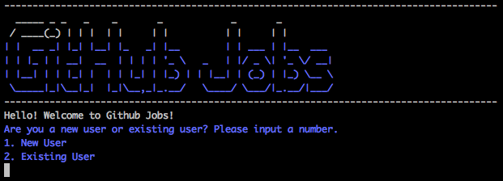
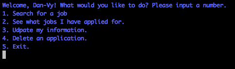
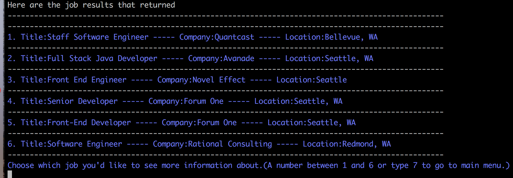
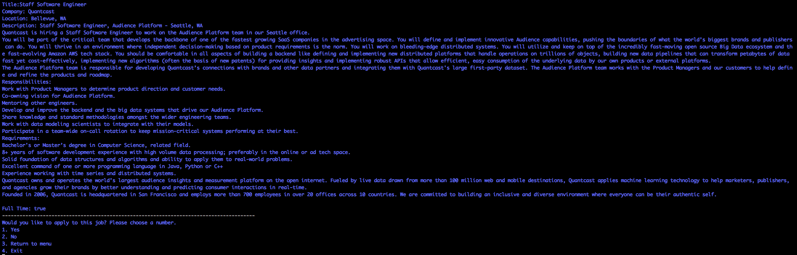
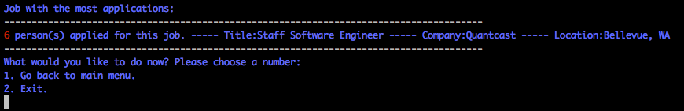
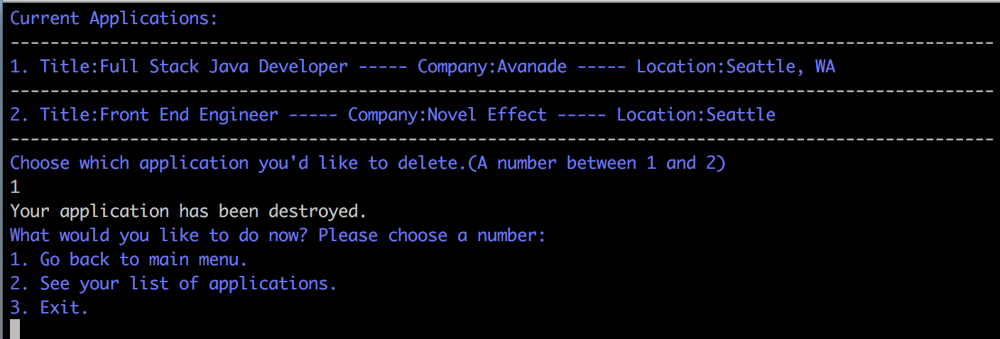

## **Github Jobs Finder**

Github Jobs Finder will help you find and apply for jobs. You can search, apply, update your information.

#### To run:

  * Type "bundle install" in your terminal to make sure you have all the needed gems.
  * To start the application, enter 'ruby bin/run.rb' in your terminal.
  * You will be prompted to answer a series of questions to help you navigate the GitHub Jobs Finder application.

##### Our three models are:

   * Users(name, birthday)
   * applications(user id, job id, title, location, company)
   * Jobs(company, location, title, description, type, created at)

##### Video demonstration

  [GitHub Job Finder](https://youtu.be/4M6DTdVyGTo)
##### User Stories

  As a user, I should be able to:
  * create a new account
  
  * Login to my account and retrieve all the jobs that I have applied.

  

  * know if I already exist in this system.

  
  * to search jobs by languages used.
  *  search job descriptions for keywords like 'diversity'.
  *  search jobs by type(part_time, full_time), location, title.
  

  
  * to know how many other users have applied for the same jobs.

  * find the job that has been applied to the most.
  
  * to delete a application that I have applied to.
  
